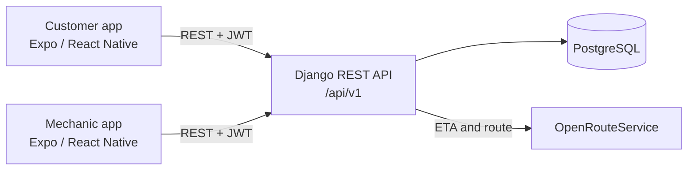

# AutoHelp — Roadside Assistance for Georgia

A two-sided roadside assistance platform: drivers request help (battery, diagnostics, car keys) from their phone, nearby mechanics receive the job, and the customer follows the mechanic on a live map until the job is done.

The repository holds three parts: a **customer app** and a **mechanic app** (React Native, Expo) and a shared **Django REST API** deployed on Render. The backend has 203 automated tests plus a staging smoke test that walks a full request from both sides.



## How a request works


A request can also be declined or cancelled (by the customer, mechanic, admin, or system). Every transition is validated on the server and recorded in a status history.

## Features

**Customer app**
- Phone-number sign-up and login, with a country picker
- Vehicle garage with a primary vehicle
- Request battery help, diagnostics, or car-key service from the current GPS location
- Live tracking: the mechanic's position, ETA, distance, and route on a map
- Approve or reject a mechanic's price quote
- Call the mechanic, rate the job, and review order history
- Resumes an in-progress request after the app is closed

**Mechanic app**
- Registration with admin approval
- Choose which services you provide; only matching offers arrive
- Accept a job, then Start Driving, Arrive, send a quote, and Complete
- Shares live GPS location while a job is open in the app
- Earnings summary, job history, and profile

**Backend**
- Service catalogue, pricing, matching, and offers
- Request lifecycle with validated transitions and status history
- Quotes, ratings, and mechanic earnings
- Route and ETA from OpenRouteService
- JWT authentication, throttling, and role checks for customer, mechanic, and admin
- OpenAPI schema with Swagger UI and ReDoc
- Django admin for approving mechanics and managing data

## Tech stack

| Part | Tools |
| --- | --- |
| Mobile apps | React Native 0.86, Expo 57, Expo Router, react-native-maps, expo-location, expo-secure-store, TypeScript |
| API | Python, Django 5.2, Django REST Framework, Simple JWT, drf-spectacular, django-filter |
| Database | PostgreSQL |
| Deployment | Render (API and database, `render.yaml`), Gunicorn, WhiteNoise |

## Repository layout

```text
apps/
├── customer/     customer Expo app
└── mechanic/     mechanic Expo app
backend/          Django project (config/ and apps/: accounts, vehicles, services, requests, ratings)
scripts/          staging smoke test
docs/             testing guide and manual device checklist
render.yaml       Render Blueprint for the API and PostgreSQL
```

## Run locally

**API** (see [backend/README.md](backend/README.md) for details):

```bash
cd backend
cp .env.example .env
docker compose up -d        # PostgreSQL
python -m venv .venv && source .venv/bin/activate
pip install -r requirements/development.txt
python manage.py migrate
python manage.py seed_dev   # development users and services (DEBUG only)
python manage.py runserver
```

Swagger UI: http://127.0.0.1:8000/api/docs/

**Mobile apps:**

```bash
cd apps/customer            # or apps/mechanic
cp .env.example .env        # set the API URL
pnpm install
pnpm start                  # open in Expo Go or an emulator
```

## Testing

```bash
cd backend && python manage.py test                  # 203 backend tests
python scripts/staging_smoke_test.py --all           # end-to-end check against staging
```

See [docs/TESTING.md](docs/TESTING.md) and [docs/MANUAL_DEVICE_TESTS.md](docs/MANUAL_DEVICE_TESTS.md).
